## Capítulo I

### 1.1. Startup Profile

#### 1.1.1. Descripción de la Startup

**Ecosphere** es una plataforma digital que aborda el desafío de la inaccesibilidad del turismo de lujo estilo glamping para gran parte de la población. En un contexto donde el turismo se está reactivando como motor económico en el Perú luego del impacto de la pandemia, nuestra solución busca democratizar esta forma de viaje, ofreciendo una experiencia personalizada, asequible y descentralizada.

Nos comprometemos a ofrecer una alternativa sostenible, inclusiva e innovadora para personas de todos los niveles socioeconómicos. Desde jóvenes viajeros y familias hasta profesionales que buscan desconexión en la naturaleza, nuestro servicio brinda la oportunidad de disfrutar de escapadas únicas en contacto con el entorno natural sin renunciar al confort.

Trabajamos con emprendedores turísticos locales, comunidades rurales y operadores de glamping para fomentar el turismo responsable, la valorización del territorio y la dinamización de economías regionales.

En Ecosphere, creemos en el poder de la tecnología y la comunidad para generar un impacto positivo en el sector turístico.

**Misión**  
Brindar experiencias de glamping personalizadas y accesibles en todo el Perú, integrando tecnología, sostenibilidad y colaboración con actores locales para transformar el turismo en una práctica inclusiva y descentralizada.

**Visión**  
Convertirnos en la plataforma líder de turismo de naturaleza de lujo accesible en Latinoamérica, promoviendo un nuevo estándar de viaje que equilibre comodidad, respeto ambiental y desarrollo local.

#### 1.1.2. Perfiles de integrantes del equipo

**Información**

| Foto | Nombre | Código | Descripción |
|------|--------|--------|-------------|
|  | Nombre: | Código: | Descripción: |
|  | Carlos Humberto Zarate Peña| U202315966 | Soy un estudiante de Ingeniería de Software curioso y constante, disfruto resolver problemas, trabajar en equipo y aprender siempre algo nuevo sobre tecnología. |
|  | Daniel Elias Ruiz Huisa | 202210764 | Soy un estudiante entusiaste que busca sacar el maximo provecho al aprendizaje. Adoro los videojuegos, la matematica oculta detras de los algoritmos y la musica. |
|  |Juan Miguel Quijano Calderón | u20221068|Mi nombre es Juan Quijano, tengo 20 años y soy un estudiante de la carrera de Ingeniería de Software. Tengo conocimientos intermedios en programación y quisiera dedicarme eventualmente al desarrollo y uso de IA. |
|  | Poly Gabriel Alcantara Baldeon | U202418250 | Soy estudiante de Ingenieria de Software. Tengo conocimientos basicos en c#, Java y Python. Me gustaria aprender mas sobre desarrollo de videojuegos |

---

### 1.2. Solution Profile

#### 1.2.1. Antecedentes y problemática

En los últimos años, el Perú ha experimentado un resurgimiento del sector turístico, impulsado por el deseo de reconexión con la naturaleza y la búsqueda de experiencias únicas post-pandemia. Sin embargo, la oferta de turismo de lujo como el glamping sigue siendo limitada, costosa y centralizada en pocos lugares turísticos de renombre.

Sin una solución efectiva para democratizar esta experiencia, el problema ha contribuido a la concentración económica en ciertos destinos y a la exclusión de sectores con menor poder adquisitivo. Parte de la oferta actual es desarrollada por actores privados que no consideran una expansión territorial equitativa, lo que agrava las brechas sociales y limita el impacto económico positivo en comunidades rurales.

**Problemática (6W + 1H)**

- **What (Qué):** Falta de acceso descentralizado, personalizado y asequible al turismo de lujo tipo glamping en el Perú.  
- **When (Cuándo):** Especialmente evidente después del resurgimiento del turismo post-pandemia.  
- **Where (Dónde):** En regiones con potencial turístico aún no desarrollado: sierra, selva, y zonas costeras alternativas del Perú.  
- **Who (Quiénes):** Afecta a turistas nacionales y extranjeros con presupuesto medio, y a comunidades rurales con potencial turístico.  
- **Why (Por qué):** Porque las propuestas actuales están centralizadas, son gestionadas por pocos operadores y mantienen precios elevados.  
- **How (Cómo):** Limita la inclusión de nuevos públicos en el turismo de lujo y frena el desarrollo de regiones fuera del circuito tradicional.  
- **How much (Cuánto):** Se estima que un 70% del turismo de lujo se concentra en menos del 15% del territorio nacional, generando oportunidades perdidas en regiones rurales con alto valor ecológico y cultural.

#### 1.2.2. Lean UX Process

##### 1.2.2.1. Lean UX Problem Statements

Los viajeros buscan experiencias inmersivas y únicas en la naturaleza, pero el turismo de lujo tipo glamping en el Perú aún es inaccesible para muchos debido a su centralización, altos costos y limitada personalización.

Esto impide que segmentos de viajeros con presupuestos medios puedan disfrutar de este tipo de experiencias y que comunidades rurales con alto potencial turístico participen del desarrollo económico que genera el turismo.

*¿Cómo podríamos diseñar una plataforma digital que permita ofrecer experiencias de glamping más accesibles, personalizadas y descentralizadas en el Perú, beneficiando tanto a los viajeros como a las comunidades locales?*

##### 1.2.2.2. Lean UX Assumptions

**Business Assumptions:**

- Las personas están dispuestas a pagar por experiencias glamping si pueden personalizarlas y se les ofrece a precios más accesibles.  
- Hay comunidades y emprendedores rurales interesados en ofrecer espacios para glamping.  
- Una plataforma centralizada puede reducir los costos de operación y aumentar la visibilidad de las experiencias.  

**Business Outcomes:**

- Incremento del número de reservas en la plataforma en un 30% en los primeros 6 meses.  
- Inclusión de al menos 10 nuevas locaciones de glamping en zonas no tradicionales durante el primer año.  
- Generación de ingresos sostenibles para aliados rurales locales.  

**User Benefits:**

- Mayor acceso a experiencias glamping a menor precio y con personalización según intereses (aventura, descanso, romance, etc.).  
- Interfaz amigable y clara para elegir locación, tipo de alojamiento, servicios y actividades.  
- Seguridad y confianza mediante gestión profesional desde la misma plataforma.  

##### 1.2.2.3. Lean UX Hypothesis Statements

- **Hipótesis 1:** Creemos que al permitir a los usuarios personalizar su experiencia de glamping (ubicación, servicios y actividades), especialmente para viajeros jóvenes y parejas, sabremos que hemos tenido éxito cuando el 60% de los usuarios personalicen al menos dos elementos de su experiencia al momento de la reserva.  
- **Hipótesis 2:** Creemos que al ofrecer experiencias de glamping en regiones descentralizadas mediante acuerdos con emprendedores locales, sabremos que hemos tenido éxito cuando el 40% de las reservas se realicen en destinos no tradicionales en los primeros seis meses.  
- **Hipótesis 3:** Creemos que al implementar una plataforma digital centralizada con opciones flexibles y visuales, sabremos que hemos tenido éxito cuando al menos el 80% de los usuarios completen una reserva sin necesidad de asistencia externa.  

##### 1.2.2.4. Lean UX Canvas

**Business Problem:**  
El turismo de lujo tipo glamping está actualmente centralizado, limitado a un público exclusivo y con escasa presencia fuera de las rutas turísticas tradicionales. Esto reduce las oportunidades de desarrollo turístico en otras regiones y excluye a viajeros con presupuestos medios.

**Users & Customers:**

- Viajeros millennials y generación Z interesados en experiencias únicas y sostenibles.  
- Parejas en busca de escapadas románticas con estilo y confort.  
- Emprendedores rurales que poseen terrenos con potencial turístico.  
- Turistas extranjeros que buscan opciones auténticas fuera de los circuitos tradicionales.  

**Hypotheses:**

- Si ofrecemos experiencias de glamping personalizadas a precios accesibles, más personas reservarán fuera de los destinos tradicionales.  
- Si involucramos a comunidades rurales, aumentará la oferta y se fomentará el desarrollo económico local.  

**Solution Ideas:**

- Plataforma con filtros dinámicos para personalizar la experiencia.  
- Sistema de alianzas con emprendedores locales y formación turística.  
- Evaluaciones en línea y reseñas confiables para cada experiencia.  
- Suscripciones o membresías para beneficios exclusivos.  

**What’s the most important thing we need to learn first?**  
Validar que existe un mercado interesado en experiencias glamping accesibles y que las comunidades estarían dispuestas a ofrecer sus espacios.

**Business Outcomes:**

- Aumento de reservas en un 30% trimestral.  
- Alianzas activas con al menos 10 comunidades en el primer año.  
- Reducción de costos operativos en un 20% gracias a la gestión digital centralizada.  

**User Benefits:**

- Más opciones, más flexibilidad y mejor precio.  
- Conexión real con la naturaleza y la cultura local.  
- Confianza, seguridad y experiencia gestionada profesionalmente.  

**What’s the least amount of work we need to do to learn the next most important thing?**  
Desarrollar un MVP funcional de la plataforma con 3 ubicaciones de prueba, opción de personalización básica y seguimiento de la experiencia del usuario desde la reserva hasta el post-estancia.

---

### 1.3. Segmentos objetivo

**Perfil 1: Jóvenes adultos (25-35 años)**  
- Estilo de vida: Aventureros, tech-savvy, buscan experiencias auténticas pero con comodidad.  
- Motivaciones: Escapadas de fin de semana, turismo interno, contacto con la naturaleza sin perder el confort.  
- Comportamiento digital: Usan apps/webs para planificar viajes, confían en reseñas, valoran la personalización.  
- Presupuesto: Medio, pero buscan optimizar valor por su dinero.  

**Perfil 2: Parejas y nómadas digitales**  
- Estilo de vida: Buscan lugares tranquilos, románticos o inspiradores.  
- Motivaciones: Desconexión, relax, celebraciones, trabajar remotamente desde lugares diferentes.  
- Comportamiento digital: Valoran privacidad, vistas únicas, buenas fotos y conexión a internet.  

**Perfil 3: Turistas extranjeros interesados en experiencias fuera del circuito tradicional**  
- Estilo de vida: Curiosos, con interés en la cultura local y sostenibilidad.  
- Motivaciones: Vivir el Perú desde una perspectiva diferente, con servicios seguros y bien organizados.  
- Comportamiento digital: Planifican con antelación, usan portales globales de viaje, valoran la autenticidad.  

## Capítulo II: Requirements Elicitation & Analysis

### 2.1. Competidores

#### 2.1.1. Análisis competitivo


**Competitive Analysis Landscape**  
-
El objetivo del análisis competitivo es investigar y evaluar los principales competidores para identificar sus estrategias de mercado y  así aprender qué estrategias podríamos implementar y hacer funcionar en nuestra aplicación para destacarnos en el mercado.


*¿Cuáles podrían ser las estrategias más efectivas para diferenciar y destacar nuestra aplicación 'Oasis' en el mercado de tal forma que nos podamos destacar en el mercado peruano por sobre la competencia?*

| Análisis SWOT | Glamping South | Booking.com | Glamping.com | Hipcamp |
|---------------|----------------|-------------|----------------|---------|
| **Overview** | Plataforma tipo blog que centraliza opciones de glamping en Sudamérica. | Multinacional de reservas con una sección específica para glamping. | Sitio web especializado en glamping de lujo a nivel mundial. | Plataforma colaborativa con foco en naturaleza y sostenibilidad, fuerte en EE.UU. |
| **Ventaja competitiva** | Selección curada y enfoque en sostenibilidad en Sudamérica. | Amplia disponibilidad global y filtros avanzados. | Experiencias premium y diseño de lujo. | Comunidad activa y filosofía ecológica. |
| **Mercado objetivo** | Viajeros interesados en naturaleza y experiencias sostenibles en Sudamérica. | Viajeros globales que buscan todo tipo de alojamiento, incluido glamping. | Turistas con alto poder adquisitivo en busca de lujo natural. | Aventureros y ecoturistas principalmente en EE.UU. y Reino Unido. |
| **Estrategia de Marketing** | Contenido tipo blog y consejos de viaje; comunicación directa. | Publicidad masiva, SEO, fidelización vía “Genius”. | Experiencia de marca premium y navegación aspiracional. | Comunidad, diseño ecológico y valores compartidos. |
| **Productos y servicios** | Información de glampings, actividades, contacto por email. | Reserva directa, filtros de sostenibilidad, variedad de alojamientos. | Buscador temático de glamping, redirección a sitios oficiales. | Reserva directa, reseñas, descripción de actividades al aire libre. |
| **Precios y costos** | Gratuito, sin precios visibles (requiere contacto directo). | Variedad de precios según espacio, con promociones. | Precios elevados por tratarse de experiencias de lujo. | Variedad, con tendencia a accesibles en camping. |
| **Canales de distribución (web/móvil)** | Solo web. | Web y app móvil. | Web. | Web y app móvil. |
| **Fortalezas** | Foco regional, contenido útil, valores ecológicos. | Gran alcance, experiencia de usuario conocida, filtros avanzados. | Selección de alta calidad, diseño atractivo. | Comunidad comprometida, diseño atractivo, filosofía sostenible. |
| **Debilidades** | No permite reserva directa, alcance limitado. | Puede resultar impersonal, stock masivo puede dificultar elección. | Enfocado a alto presupuesto, sin opción de reserva directa. | Limitado a países angloparlantes, especialmente EE.UU. |
---
#### 2.1.2. Estrategias y tácticas frente a competidores

**Estrategias de Oasis:**
-
- Marketing regular por medio de redes sociales.
- Convenio con dueños de lugares que entren en el concepto de glamping.
- Interfaz sencilla e intuitiva, facil de uso para el usuario promedio.
- Funcionalidades adicionales:
  - Filtros por precios.
  - Notificaciones.
  - Recomendaciones según busquedas recientes.
  - Dar un pequeño resumen de la zona en la que está el lugar.
- Seguridad en el booking y seguimiento constante
- Facilitar la comunicación constante con los dueños de los lugares.
- Privacidad en los datos personales y medios de pago:
   - Facilitar el pago por medio de cuotas sin intereses (con un límite).
- Estar especializados en el mercado peruano (en estapas tempranas).
---

### 2.2. Entrevistas

#### 2.2.1. Diseño de entrevistas

**Preguntas para clientes:**

1. ¿Tiene pleno conocimiento de lo que es el glamping?
2. ¿Probaría un aplicación para facilitar el booking de gampling en distintos lugares del perú?
3. ¿Qué tipo de información quisiera conocer del lugar en el cual se quedaría?
4. ¿Qué zonas del país le parecen más atractivas para hacer glamping?
5. ¿Ha usado alguna vez un app para reservar lugares para acampar o similar? De no ser el caso ¿Cómo se enteró de dichos lugares?
6. ¿Qué medios de pago prefiere? ¿La facilidad para hacer pagos por cuotas le parece importante?
7. ¿Si quisiera reservar un lugar para hacer glamping, bajo que criteríos haría su búsqueda?
8. ¿Qué garantías le gustaría que ofrezca una app para hacer su booking para un lugar de glamping?
9. ¿Qué tanto prioriza la comunicación con el dueño del lugar donde planea quedarse?
10. ¿Se siente más seguro al tener un intermediario; cómo una aplicación en este caso, para hacer este tipo de gestiones?


#### 2.2.2. Registro de entrevistas
Entrevista #1 - Juan Calderón.
-
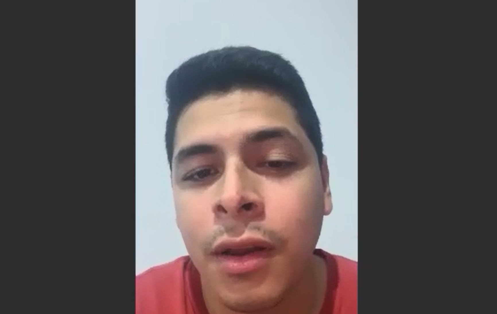
https://drive.google.com/file/d/17AFZaJjcbcRVmYiHYgJDLiXQZu9t8cME/view?usp=sharing


Entrevista #2 - Vero Rojas
-

https://drive.google.com/file/d/17AFZaJjcbcRVmYiHYgJDLiXQZu9t8cME/view?usp=sharing

Entrevista #3 César León
-

https://drive.google.com/file/d/17AFZaJjcbcRVmYiHYgJDLiXQZu9t8cME/view?usp=sharing


#### 2.2.3. Análisis de entrevistas

-Todos los entrevistados tuvieron en común el que se sentirían más seguros al tener un intermediario a la hora de hospedarse en un lugar, no solo para glamping.

-El medio de pago preferido fué tarjeta de crédito, se apreciaban las cuotas de ser posible.

-Los filtros más repetidos fueron la capacidad de personas, precio y lugar. 

-Curiosamente, la región más solicitada fué la sierra. 

-Dos de tres solo habían pensado en reservar por medio de contactos cercanos.


### 2.3. Needfinding

#### 2.3.1. User Personas

Desarrollados a partir de las entrevistas.

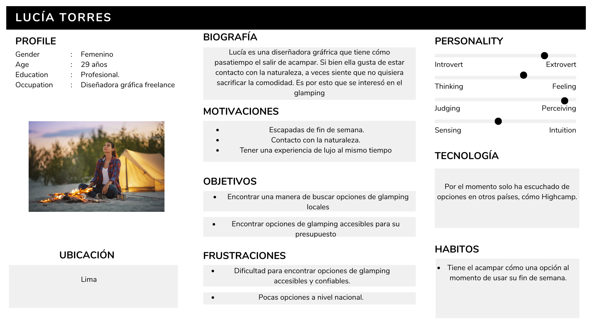
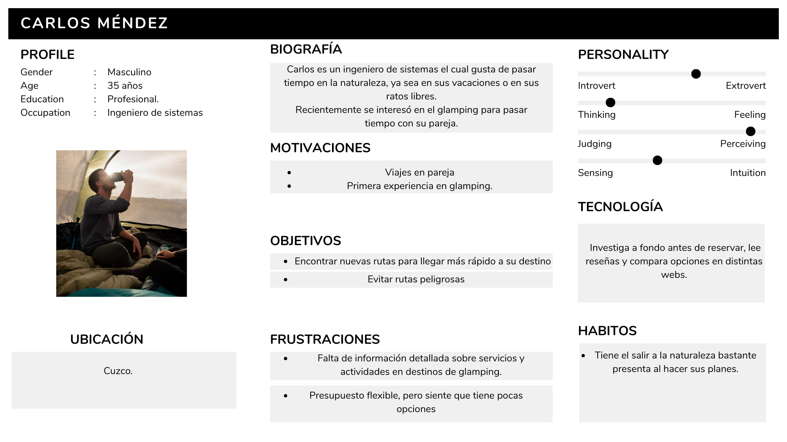
---

#### 2.3.2. User Task Matrix

| **Tarea**                             | **Frecuencia** | **Importancia** |
|---------------------------------------|----------------|-----------------|
| Buscar destinos de glamping           | Alta           | Alta            |
| Comparar precios y servicios          | Media          | Alta            |
| Leer reseñas de otros usuarios        | Alta           | Media           |
| Contactar al anfitrión                | Media          | Media           |
| Realizar reserva y pago               | Alta           | Alta            |
| Compartir experiencia post-viaje      | Media          | Media           |


#### 2.3.3. User Journey Mapping

Se construyeron mapas que detallan las etapas de experiencia de los usuarios al encontrar Oasis.
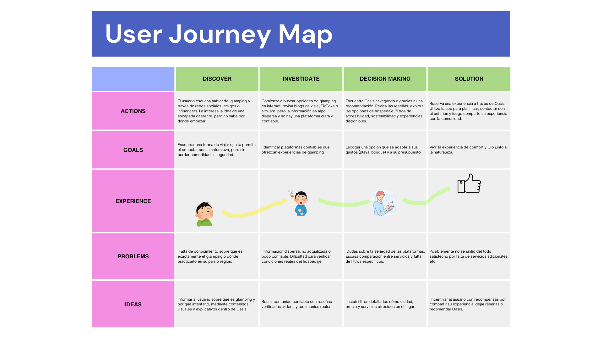

#### 2.3.4. Empathy Mapping

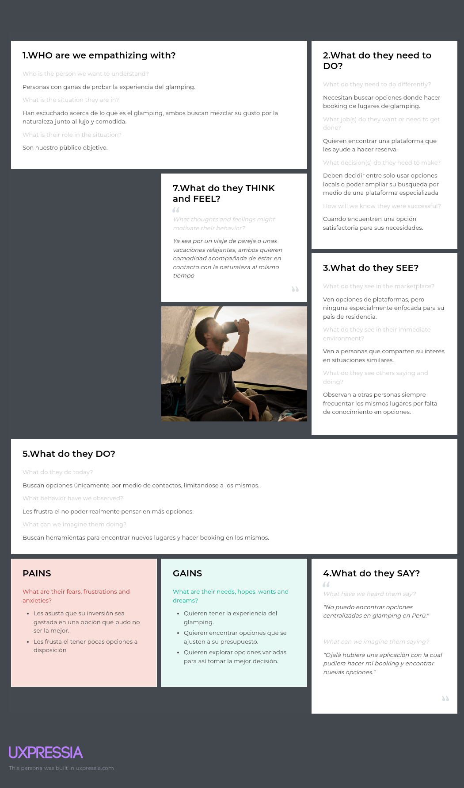

#### 2.3.5. As-is Scenario Mapping

|                        | **Conciencia del problema**                                                                                                                               | **Búsqueda de información**                                                                                                                | **Intento de acción**                                                                                                                      | **Reflexión y ajustes**                                                                                                                    |
|------------------------|------------------------------------------------------------------------------------------------------------------------------------------------------------|--------------------------------------------------------------------------------------------------------------------------------------------|---------------------------------------------------------------------------------------------------------------------------------------------|---------------------------------------------------------------------------------------------------------------------------------------------|
| **Doing**              | - El usuario escucha sobre experiencias de glamping y se interesa por vivir una. <br> - Se da cuenta de que no hay una plataforma especializada. <br> - Nota que la información está dispersa y confusa. | - Busca opciones en Google, redes sociales y plataformas como Airbnb. <br> - Explora blogs y foros de viajes, pero no encuentra filtros adecuados para glamping. | - Intenta reservar desde diferentes páginas, alternando entre redes sociales y sitios de hospedaje. <br> - Contacta directamente con anfitriones por WhatsApp. | - Percibe que el proceso fue más complicado de lo esperado. <br> - Piensa que sería más fácil si existiera una app centrada solo en glamping. |
| **Thinking**           | “Quiero algo diferente, tranquilo, en contacto con la naturaleza.” <br> “No sé dónde buscar glamping real, no solo cabañas bonitas.”                         | “Hay muchas páginas, pero ninguna parece especializada en esto.” <br> “¿Cómo sé si este lugar es seguro, ecológico o accesible?”            | “¿Este perfil será confiable? ¿Y si no es lo que muestran las fotos?” <br> “Tengo que revisar muchas plataformas para estar seguro.”        | “Ojalá existiera una sola plataforma donde todo esté verificado y adaptado al estilo glamping que busco.”                                  |
| **Feeling**            | - Curiosidad por vivir una experiencia nueva y natural. <br> - Confusión por la falta de información centralizada.                                        | - Frustración al comparar muchas opciones sin claridad. <br> - Inseguridad respecto a las condiciones reales de los espacios.               | - Ansiedad al no saber si la reserva fue segura. <br> - Cansancio por la cantidad de pasos involucrados en el proceso.                     | - Deseo de compartir su experiencia, pero sin un canal o comunidad específica. <br> - Esperanza de que una futura app simplifique todo.     |

## Capítulo III: Requirements Elicitation Specification
#### 3.1. To-Be Scenario Mapping
To-Be Scenario Mapping para usuario que reserva


To-Be Scenario Mapping para usuario emprendedor que brinda servicios de hospedaje


#### 3.2. User Stories. 

| # Orden | User Story Id | Título | Descripción | Story Points (1 / 2 / 3 / 5 / 8) |
|:-------:|:-------------:|:------:|:-----------:|:-------------------------------:|
| 1 | US01 | Personalización Glamping | Como viajero joven que busca desconexión en la naturaleza quiero personalizar mi experiencia de glamping según mis gustos para sentir que el viaje es único y hecho a mi medida. | 5 |
| 2 | US02 | Glamping Asequible | Como usuaria con presupuesto limitado quiero encontrar opciones de glamping asequibles fuera de los destinos típicos, para poder vivir una experiencia única sin gastar demasiado. | 5 |
| 3 | US03 | Navegación Plataforma | Como usuario primerizo en la plataforma quiero navegar fácilmente por la plataforma y entender cada paso de la reserva, para sentirme seguro y confiado al hacer mi primera compra. | 3 |
| 4 | US04 | Filtros de Escapadas | Como viajero que quiere escapar un fin de semana quiero poder filtrar experiencias según fechas disponibles y distancia desde mi ubicación, para planear escapadas cortas sin complicaciones. | 5 |
| 5 | US05 | Reseñas y Calificaciones | Como usuario que desconfía de nuevas plataformas quiero ver reseñas y calificaciones de otros viajeros sobre cada experiencia, para tomar decisiones con mayor confianza. | 3 |
| 6 | US06 | Fotos Reales | Como cliente que busca confort y naturaleza quiero ver fotos reales del alojamiento, sus servicios y el entorno, para tener expectativas claras de lo que voy a recibir. | 3 |
| 7 | US07 | Recomendaciones Personalizadas | Como explorador que ya viajó con ustedes quiero tener recomendaciones para seguir descubriendo nuevos destinos que se adapten a mí. | 5 |
| 8 | US08 | Registro Anfitriones | Como emprendedora rural con un terreno atractivo quiero registrarme fácilmente en la plataforma con ayuda técnica, para poder ofrecer mi espacio sin complicaciones. | 5 |
| 9 | US09 | Impulso al Turismo Local | Como parte de una comunidad alejada de los destinos turísticos quiero que la plataforma me ayude a atraer visitantes a mi región, para impulsar el turismo local y generar ingresos sostenibles. | 8 |
| 10 | US10 | Notificaciones a Anfitriones | Como anfitrión con poca experiencia digital quiero recibir notificaciones para sentirme acompañado en todo momento. | 3 |
| 11 | US11 | Contar Historia Local | Como anfitrión que quiere destacar su experiencia quiero poder contar mi historia y mostrar los valores de mi comunidad en mi perfil, para conectar con los viajeros. | 5 |
| 12 | US12 | Acceso a Comentarios | Como emprendedor que quiere crecer quiero acceder a reservas y comentarios, para entender cómo mejorar mi oferta y atraer más clientes. | 3 |
| 13 | US13 | Comunidad de Anfitriones | Como miembro de una comunidad con otros anfitriones quiero poder colaborar y aprender de otros emprendedores en la red, para fortalecer nuestras capacidades y generar impacto juntos. | 5 |


#### 3.3. Impact Mapping.


---

##  Ubiquitous Language

En el contexto del desarrollo del proyecto **Oasis**, hemos definido un lenguaje ubicuo compartido por el equipo técnico y no técnico, para asegurar una comprensión clara y coherente del dominio. A continuación, se detallan los principales términos y sus definiciones:

| Término                        | Definición                                                                 |
|-------------------------------|---------------------------------------------------------------------------|
| **Glamping**                  | Modalidad de alojamiento que combina el confort del hotel con la experiencia inmersiva del camping en la naturaleza. |
| **Experiencia**               | Actividad adicional que puede ofrecer un anfitrión, como caminatas guiadas, talleres, observación de estrellas, entre otros. |
| **Reserva**                   | Proceso mediante el cual un usuario asegura su estadía en un hospedaje y/o experiencia mediante la app. |
| **Filtro de ubicación**   | Funcionalidad que permite a los usuarios encontrar alojamientos según la zona |
| **Filtro por precio**  | Funcionalidad que permite buscar hospedajes según el precio. |
| **Usuario Oasis**             | Persona que utiliza la plataforma para buscar, reservar o calificar hospedajes y experiencias. |
| **Reputación del anfitrión**  | Calificación promedio que recibe el anfitrión basada en la experiencia y reseñas de los usuarios. |
| **Panel del anfitrión**       | Herramienta dentro de Oasis que permite a los anfitriones gestionar sus espacios, reservas y responder consultas. |
| **Reseña comunitaria**        | Comentario que un usuario deja luego de una experiencia, útil para futuros viajeros. |
| **Mapa de alojamientos**      | Visualización geográfica de todos los hospedajes disponibles en la plataforma Oasis. |

Este vocabulario facilita la comunicación entre diseñadores, desarrolladores, testers y stakeholders durante todas las fases del proyecto.


---
# Capítulo IV: Product Design

## 4.1. Style Guidelines

Nuestro producto busca transmitir una experiencia de lujo accesible, relajante y cercana a la naturaleza. Hemos definido un tono de comunicación casual, respetuoso y sereno.

### 4.1.1. General Style Guidelines

- **Logo**:  
Esta aplicación representa una propuesta innovadora de turismo de lujo accesible, conocida como Oasis. El logo refleja esta visión al combinar elementos naturales y modernos: el avión representa el viaje y la conexión con nuevos destinos, mientras que la palmera y el mar evocan la tranquilidad y el contacto con la naturaleza. La luna llena sugiere noches serenas al aire libre, una característica distintiva del glamping. Los colores suaves y relajantes refuerzan la idea de descanso y desconexión, pilares fundamentales de nuestra propuesta. Este logo busca transmitir aventura, accesibilidad y confort en armonía con el entorno natural.
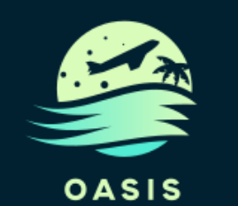

- **Tipografía**:  
  - Títulos: *Poppins*, tamaño 56px.  
  - Cuerpo: *Open Sans*.

- **Colores de Marca**:
  - Verde pastel: `#CFFFD8`
  - Turquesa suave: `#76E3D1`

- **Colores secundarios**:
  - Azul océano: `#3CBCCF`
  - Verde marino: `#289C99`
  - Amarillo lunar: `#F5FDE3`

- **Tonos oscuros**:
  - Negro profundo: `#001A23`
  - Gris azulado oscuro: `#2A3A3F`
  - Gris medio: `#4A5A5F`

- **Tonos claros**:
  - Gris claro: `#BFCFCC`
  - Blanco humo: `#F1F8F6`
  - Blanco puro: `#FFFFFF`

### 4.1.2. Web Style Guidelines

El sitio web de Oasis Perú presenta un diseño limpio y moderno,  empleando una atractiva paleta de colores turquesa y azul marino que refuerza su identidad de marca. La navegación es intuitiva, con un menú superior que incluye las opciones 'Inicio', 'Destinos', 'Experiencias' y 'Eventos', claramente visibles y espaciadas de forma óptima para una fácil interacción. El titular principal, "TU DESTINO TE ESTÁ ESPERANDO", en negrita sobre un fondo turquesa claro, atrae inmediatamente la atención del usuario. La frase secundaria, "DESCUBRE DESTINOS SORPRENDENTES", complementa el titular, invitando a la exploración. Un botón de llamada a la acción, "INGRESA AQUÍ", guía al usuario hacia una experiencia inmersiva. En conjunto, el diseño es visualmente atractivo y facilita la navegación, creando una experiencia de usuario positiva y coherente con la propuesta de Oasis Perú.

### 4.1.3. Mobile Style Guidelines

- Colores: Menta pastel + Azul marino oscuro.
- Logo: Avión, luna y palmeras.
- Textos:
  - Título: *OASIS PERÚ*
  - Eslogan: "TU DESTINO TE ESTÁ ESPERANDO"
  - Subtexto: "DESCUBRE LUGARES SORPRENDENTE"
- Botón: **"INGRESA AQUÍ"**

## 4.2. Information Architecture

### 4.2.1. Organization Systems

- **Usuarios**:  
  - Jerarquía para navegación: Inicio > Destinos > Experiencias > Eventos.
  - Lineal para reservas: Ubicación → Servicios → Pago.

- **Anfitriones**:  
  - Jerarquía para publicar hospedajes, editar, ver reservas y estadísticas.

### 4.2.2. Labeling Systems

- Barra de navegación:  
  “Explora”, “Reserva”, “Conecta”, “Relájate”, “Disfruta”.

- Etiquetas por tipo de experiencia:  
  _"Romántico"_, _"Aventura"_, _"Relax"_, _"Familiar"_.

### 4.2.3. SEO Tags and Meta Tags

```html
<title>Glamping Perú - Vive la naturaleza con estilo</title>
<meta charset="utf-8">
<meta name="description" content="Plataforma de reservas de glamping en el Perú. Escapadas únicas, accesibles y personalizadas para reconectar con la naturaleza sin perder el confort.">
<meta name="author" content="Equipo Glamping Perú">
<meta name="copyright" content="© 2025 Glamping Perú">
```

### 4.2.4. Searching Systems

El sistema de búsqueda de la plataforma Oasis está diseñado para facilitar la personalización y rapidez en la selección de experiencias de glamping. Se implementa un motor de búsqueda con filtros dinámicos que permite a los usuarios encontrar destinos según sus preferencias específicas.
Características:
Búsqueda por filtros: ubicación, tipo de alojamiento (domo, yurta, cabaña), rango de precios, tipo de experiencia (romántica, familiar, aventura), y servicios disponibles (wifi, desayuno, jacuzzi, etc.).
Búsqueda predictiva/autocompletado: al escribir el nombre de una región o destino, se sugieren opciones populares.
Historial de búsqueda y recomendaciones: el sistema muestra búsquedas recientes y destinos recomendados según las elecciones anteriores del usuario.

### 4.2.5. Navigation Systems

El sistema de navegación está diseñado para ofrecer una experiencia fluida, intuitiva y accesible tanto en dispositivos móviles como en escritorio. Se basa en un enfoque jerárquico con elementos lineales para el proceso de reserva.
Características:<br>
- Menú de navegación superior fijo: incluye secciones como Inicio, Destinos, Experiencias, Eventos y Mi Cuenta.<br>
- Navegación por etapas (lineal) para reservas: el usuario sigue un flujo paso a paso: elegir destino → seleccionar alojamiento → configurar servicios → confirmar reserva.<br>
- Accesos directos visuales: uso de tarjetas clicables con imágenes destacadas que conducen a destinos o categorías populares.

## 4.3. Landing Page UI Design
### 4.3.1. Landing Page Wireframe

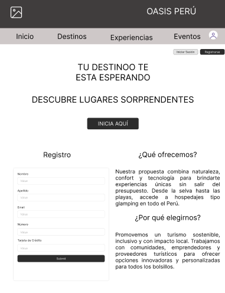

### 4.3.2. Landing Page Mock-up

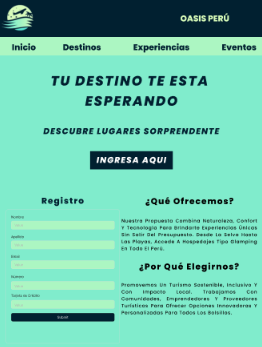 

## 4.4. Web Applications UX/UI Design

### 4.4.1. Web Applications Wireframes

Wireframe Inicio de Sesión

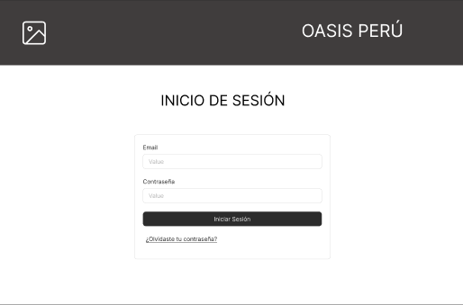 

Wireframe Registrarse

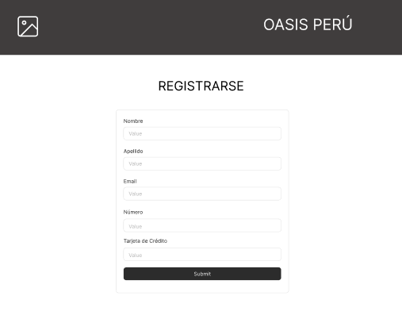 

Wireframe Destinos

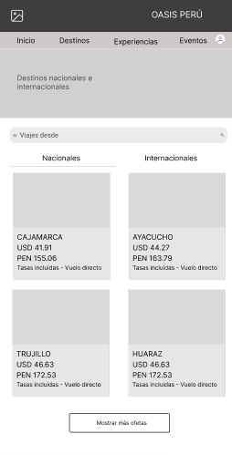 

Wireframe Eventos

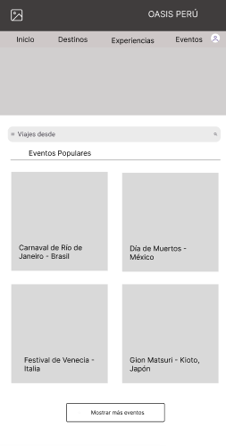 

Wireframe Experiencias

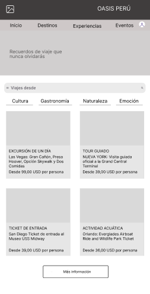 

### 4.4.2. Web Applications Wireflow Diagrams

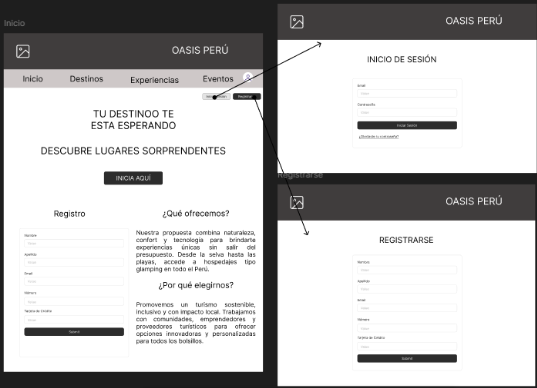 

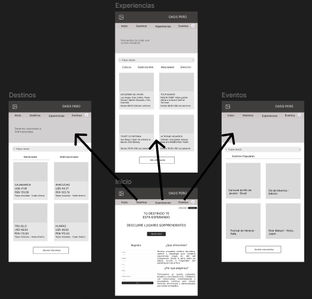 

### 4.4.3. Web Applications Mock-ups

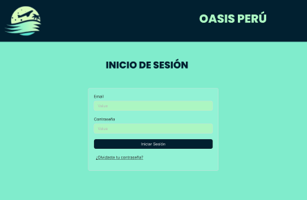 

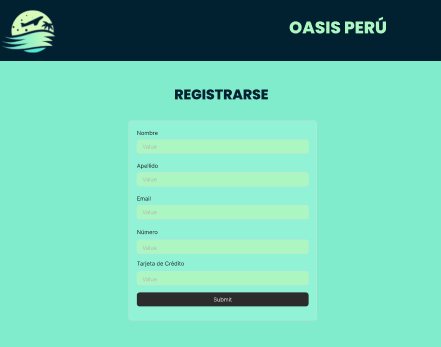 

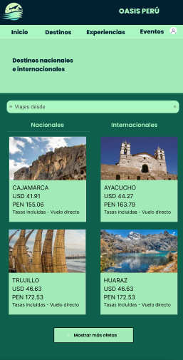 

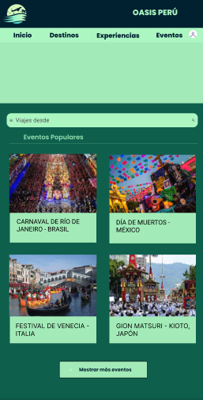 

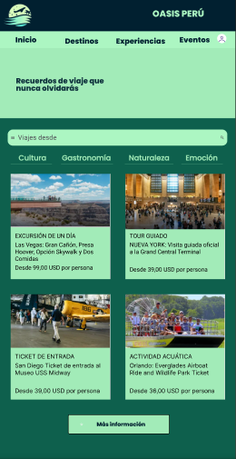 

## Capítulo V: Product Implementation, Validation & Deployment
### 5.1. Software Configuration Management.
#### 5.1.1. Software Development Environment Configuration.
En esta sección, detallaremos las herramientas y plataformas que hemos utilizado como equipo para la realización de nuestro startup. Estas herramientas son esenciales para el desarrollo, la colaboración y la gestión del proyecto. A continuación, se presenta un resumen de cada una de las herramientas utilizadas:

- **GitHub**

    **Descripción:** GitHub es una plataforma de alojamiento de código fuente y colaboración basada en Git. Nos permite gestionar el código del proyecto, realizar revisiones de código, y colaborar de manera eficiente con nuestro equipo.<br>
    **Uso:** Se utilizó para el versionado del código, gestión de ramas y pull requests, así como para la documentación del proyecto.

- **Git**

    **Descripción:** Git es un sistema de control de versiones distribuido que facilita la gestión de cambios en el código fuente.<br> **Uso:** Se empleó para realizar commits, push y pull de cambios, así como para la gestión de ramas, permitiendo una colaboración fluida y eficiente en el desarrollo del proyecto.

- **Canva**

    **Descripción:** Canva es una herramienta de diseño gráfico en línea que permite crear gráficos y elementos visuales de manera intuitiva.<br> **Uso:** Se utilizó para diseñar gráficos y elementos visuales para la landing page del proyecto, incluyendo banners, íconos y otros elementos de diseño que mejoran la presentación visual de la aplicación.

- **Visual Studio Code**

    **Descripción:** Visual Studio Code (VS Code) es un editor de código fuente ligero y extensible que soporta una amplia variedad de lenguajes de programación.<br> **Uso:** Se utilizó como el principal editor de código para escribir y editar el código del proyecto, aprovechando sus extensiones para mejorar la productividad y facilitar el desarrollo.

- **Google Meet**

    **Descripción:** Google Meet es una herramienta de videoconferencia que permite realizar reuniones virtuales con facilidad.<br> **Uso:** Se utilizó para llevar a cabo reuniones virtuales de equipo, facilitando discusiones en tiempo real y presentaciones de avances del proyecto a los stakeholders y al equipo.

- **Figma**

    **Descripción:** Figma es una herramienta de diseño colaborativo en línea que permite crear y prototipar interfaces de usuario.<br> **Uso:** Se empleó para el diseño de interfaces y prototipos del proyecto, permitiendo la colaboración en tiempo real entre diseñadores y desarrolladores para ajustar y revisar el diseño de la aplicación.

#### 5.1.2. Source Code Management.

**Gestión del Código Fuente:**

En esta sección, se detalla cómo manejamos y supervisamos el desarrollo del código para el proyecto. Utilizamos GitHub como nuestra plataforma principal para la gestión del código fuente, complementada por Git como sistema de control de versiones. Además, seguimos el flujo de trabajo GitFlow para estructurar el desarrollo de manera eficiente.

- Repositorio GitHub para nuestra Landing Page:(pendiente)

**Ramas Principales:**
- **main:** Esta rama, a menudo llamada "master", contiene la versión más estable y final del proyecto, lista para ser desplegada en producción. Los cambios integrados en esta rama han pasado todas las pruebas y revisiones necesarias, y se consideran completamente preparados para su lanzamiento.

- **develop:** La rama develop es el punto central de integración para las nuevas funcionalidades y mejoras en desarrollo. Las características y correcciones se fusionan en esta rama, donde se realizan pruebas adicionales antes de su eventual integración en la rama main.

**Ramas Auxiliares:**

- **releases:** Las ramas de tipo releases se crean para preparar nuevas versiones del proyecto. En estas ramas se llevan a cabo las pruebas finales y se corrigen errores menores antes del lanzamiento oficial. Una vez que una versión ha sido validada, los cambios se integran en la rama develop para futuros desarrollos y luego se fusionan en la rama main para su despliegue.

**Uso de GitFlow:**

- **Feature Branches:** Se utilizan ramas de características para desarrollar nuevas funcionalidades. Estas ramas se crean a partir de la rama develop y, una vez que se completa el desarrollo y se aprueban las revisiones, se fusionan nuevamente en la rama develop.

- **Bugfix Branches:** Para solucionar errores que necesitan ser corregidos antes de la siguiente versión, se utilizan ramas de corrección de errores. Estas ramas se crean a partir de la rama develop o, en casos críticos, desde la rama main.

- **Hotfix Branches:** Se emplean para abordar errores críticos que requieren una solución urgente en producción. Estas ramas se crean a partir de la rama main, y una vez que el problema se resuelve, los cambios se fusionan tanto en la rama main como en la rama develop.

**Commits Conventions:**

Los commits se nombran de acuerdo con el avance y el contenido específico del trabajo realizado. No seguimos una convención rígida para los nombres de los commits; en su lugar, los desarrolladores utilizan descripciones claras y concisas para reflejar las modificaciones implementadas. Esto nos permite una mayor flexibilidad a la hora de registrar el progreso, asegurando que cada commit tenga un nombre que represente con precisión el trabajo efectuado.

#### 5.1.3. Source Code Style Guide & Conventions.
Hemos implementado varias convenciones de estilo para asegurar un desarrollo de código claro y consistente en distintos lenguajes y tecnologías:

1. El tipo de documento se declara al inicio del archivo con `<!DOCTYPE html>`.

2. Se añaden los meta tags necesarios.

3. La etiqueta `<title>` se incluye dentro del bloque `<head>`.

4. Usamos una indentación de dos espacios.

5. Se escriben en minúsculas los nombres de los elementos HTML, atributos, propiedades, valores y selectores CSS.

6. Los atributos de los elementos HTML siempre están entre comillas.

7. Cada elemento HTML debe contar con su etiqueta de cierre.

8. Se evita escribir líneas de código demasiado largas.

9. Para las imágenes, se especifican tanto el ancho y alto como el texto alternativo.

<b>JavaScript</b>

1. Cada línea de código termina con un punto y coma.

2. Las variables y funciones siguen la convención de CamelCase.

3. Las cadenas de texto (strings) se colocan entre comillas simples.

4. La indentación es de 2 espacios.

5. Se utiliza preferentemente let y const en lugar de var para declarar variables.

6. Gherkin (Convenciones de Gherkin para Especificaciones Legibles)

7. Se utilizan los términos "Given", "When", "Then" y "And" para definir los pasos del escenario.

8. Los pasos que comienzan con "And" se indentan.

9. Se deja una línea en blanco entre los pasos.

10. Los parámetros se colocan entre comillas simples.

11. Se separan los escenarios con un comentario y dos líneas en blanco.

Estas convenciones nos ayudan a mantener el código organizado, legible y coherente a lo largo del proyecto.

#### 5.1.4. Software Deployment Configuration.

Explicaremos cómo realizar el despliegue de nuestra Landing Page utilizando el servicio automatizado en la nube de GitHub Pages. A continuación, detallaremos los pasos necesarios para lograr este proceso.

### 5.2. Landing Page, Services & Applications Implementation.
#### 5.2.1. Sprint 1.
#### 5.2.1.1. Sprint Planning 1.

| Sprint #              | Sprint 1 |
|-----------------------|----------|
| **Sprint Planning Background** |          |
| **Date**              | 23/04/2025 |
| **Time**              | 19:00 horas (GMT-5) |
| **Location**          | Virtual (Google Meet) |
| **Prepared By**       |  |
| **Attendees (to planning meeting)** |     |
| **Sprint 1 Review Summary** |  |
| **Sprint 1 Retrospective Summary** | |
| **Sprint Goal & User Stories** |          |
| **Sprint 1 Goal**     | Completar las principales secciones de la Landing Page de la aplicación , permitiendo a los usuarios explorar y familiarizarse con la plataforma. |
| **Sprint 1 Velocity** | **8**  
Se estima una capacidad de n Story Points para este sprint, tomando en cuenta las tareas relacionadas con el desarrollo de la Landing Page. |
| **Sum of Story Points** | n |

#### 5.2.1.2. Aspect Leaders and Collaborators.

#### 5.2.1.3. Sprint Backlog 1

| **Sprint #** | **Sprint 1** |
|--------------|--------------|

| **User Story** | **Work-Item / Task** |
|--------------|--------------|

| **Id**        | **Title**                                | **Id**  | **Title**                     | **Description**                                                    | **Estimation (Hours)** | **Assigned To**                    | **Status** |
|--------------|------------------------------------------|---------|-------------------------------|--------------------------------------------------------------------|------------------------|-----------------------------------|------------|
 | US01 | Barra de navegación en la Landing Page | TS01 |Barra de navegación en la Landing Page (Desarrollado en HTML, CSS y JS).| Implementación del header y la barra de navegación, desarrollados en HTML, CSS y JS con diseño responsive. | 8      |  | Done     |
 | US01 | 	Sección de beneficios de la Aplicación   | TS02 | Sección de beneficios (Desarrollado en HTML, CSS y JS).|Desarrollar una sección que destaque los beneficios clave de RideFind utilizando HTML, CSS, y componentes reutilizables con diseño responsive. | 6                |  | Done                                   |
 | US01 | Información sobre Nosotros           | TS03 | Sección de "Acerca de" (Desarrollado en HTML, CSS y JS).| Implementar la sección "Sobre Nosotros", mostrando información clave de la empresa con diseño responsive y optimización para dispositivos móviles y tablets. | 4                 |    | Done                                   |
 | US01 | Redes Sociales y Footer | TS04 | Redes Sociales y Footer (Desarrollado en HTML, CSS y JS).| Crear un footer con enlaces a redes sociales, optimizado para diferentes resoluciones de pantalla, asegurando su visibilidad en todo tipo de dispositivos.| 4 |  | Done
 | US01 | Sección de contacto | TS04 | Sección de contacto (Desarrollado en HTML, CSS y JS).| Implementar una sección de contacto con un formulario básico, validación de datos, y diseño responsive para garantizar su correcto funcionamiento en móviles.| 4 |  | Done

 #### 5.2.1.4. Development Evidence for Sprint Review.
 En esta seccion se busca detallar el proceso por la cual se trabajo el Sprint 1 indicando el repositorio en la cual se trabajo las ramas que se usaron dentro de dicho repositorio, el id con su mensaje y la fecha en la que se realizo de esta manera tener un registro del avance de los task planteados.

| Repository          | Branch            | Commit Id | Commit Message           | Commit Message Body            | Committed on (Date) |
|---------------------|-------------------|-----------|--------------------------|--------------------------------|---------------------|
| https://g ithub.com/AplicacionesWebGrupo1/ Landing-page-CicloVia  | develop/styles.css | 095c8984d560b6c89642c83e6fa0aa174cd479c3      | Update styles.css       | -- | 25/04/2024  |
|   | develop/styles.css |       |        | -- | 25/04/2024  |
|   | develop/styles.css |       |        | -- | 25/04/2024  |
|   | develop/styles.css |       |        | -- | 25/04/2024  |
|   | develop/styles.css |       |        | -- | 25/04/2024  |
|   | develop/styles.css |       |        | -- | 25/04/2024  |
|   | develop/styles.css |       |        | -- | 25/04/2024  |
|   | develop/styles.css |       |        | -- | 25/04/2024  |
|   | develop/styles.css |       |        | -- | 25/04/2024  |


 
 #### 5.2.1.5. Execution Evidence for Sprint Review.
 
 #### 5.2.1.6. Services Documentation Evidence for Sprint Review.
 
 #### 5.2.1.7. Software Deployment Evidence for Sprint Review.
 
 #### 5.2.1.8. Team Collaboration Insights during Sprint.
 


